# Fluxo Saga — Checkout

## Visão Geral

O endpoint `/checkout` é exposto pelo **Gateway** via HTTP (`POST /checkout`). O Gateway atua apenas como proxy, encaminhando a requisição para o **Order Service**. A partir daí, o fluxo Saga é orquestrado de forma assíncrona via **Kafka**.

O **Notification Service** existe no projeto mas **não participa** do fluxo Kafka atualmente.

---

## Fluxo Passo a Passo (Happy Path)

| Passo | Origem        | Destino         | Ação                                                                                               |
| ----- | ------------- | --------------- | -------------------------------------------------------------------------------------------------- |
| 1     | Cliente       | Gateway         | `POST /checkout`                                                                                   |
| 2     | Gateway       | Order Service   | Proxy HTTP `POST /checkout`                                                                        |
| 3     | Order Service | Kafka           | Cria ordem no DB, publica `saga_start_checkout`                                                    |
| 4     | Kafka         | Orchestrator    | Consome `saga_start_checkout`, insere saga state `PENDING_STOCK`, publica `command_reserve_stock`  |
| 5     | Kafka         | Stock Service   | Consome `command_reserve_stock`, reserva estoque, publica `reply_stock_reserved_success`           |
| 6     | Kafka         | Orchestrator    | Consome sucesso, atualiza para `PENDING_PAYMENT`, publica `command_process_payment`                |
| 7     | Kafka         | Payment Service | Consome `command_process_payment`, simula pagamento (80% sucesso), publica `reply_payment_success` |
| 8     | Kafka         | Orchestrator    | Consome sucesso, atualiza para `COMPLETED`, publica `saga_order_status_updated`                    |
| 9     | Kafka         | Order Service   | Consome `saga_order_status_updated`, atualiza pedido para `completed`                              |

---

## Fluxos de Falha

### Falha no Estoque

Quando o Stock Service não consegue reservar o estoque:

1. Stock Service publica `reply_stock_reserved_fail`
2. Orchestrator consome a falha, atualiza o estado para `FAILED` e publica `saga_order_status_updated`
3. Order Service consome e atualiza o pedido para `cancelled`
4. **Fim do fluxo** — nenhuma compensação é necessária, pois nenhum recurso foi alocado.

### Falha no Pagamento

Quando o Payment Service falha (20% dos casos simulados):

1. Payment Service publica `reply_payment_fail`
2. Orchestrator consome a falha e atualiza o estado para `ROLLBACKING_STOCK`
3. Orchestrator publica `command_release_stock`
4. Stock Service consome o comando, libera o estoque reservado e publica `reply_stock_released_success`
5. Orchestrator consome o sucesso da liberação, atualiza o estado para `FAILED` e publica `saga_order_status_updated`
6. Order Service consome e atualiza o pedido para `cancelled`
7. **Fim do fluxo** — saga cancelada, estoque restaurado.

---

## Diagrama do Fluxo

```mermaid
graph TD
    %% Atores
    Cliente[Cliente]
    Gateway[Gateway]
    OrderService[Order Service]
    Kafka[Kafka]
    Orchestrator[Orchestrator]
    StockService[Stock Service]
    PaymentService[Payment Service]

    %% Happy Path (verde)
    Cliente -->|POST /checkout| Gateway
    Gateway -->|proxy HTTP| OrderService
    OrderService -->|publica saga_start_checkout| Kafka
    Kafka -->|saga_start_checkout| Orchestrator
    Orchestrator -->|state: PENDING_STOCK<br/>publica command_reserve_stock| Kafka
    Kafka -->|command_reserve_stock| StockService
    StockService -->|reply_stock_reserved_success| Kafka
    Kafka -->|sucesso estoque| Orchestrator
    Orchestrator -->|state: PENDING_PAYMENT<br/>publica command_process_payment| Kafka
    Kafka -->|command_process_payment| PaymentService
    PaymentService -->|reply_payment_success| Kafka
    Kafka -->|sucesso pagamento| Orchestrator
    Orchestrator -->|state: COMPLETED<br/>publica saga_order_status_updated| Kafka
    Kafka -->|saga_order_status_updated| OrderService
    OrderService -->|atualiza pedido| FimSucesso((Fim))

    %% Falha no Estoque (vermelho)
    StockService -.->|reply_stock_reserved_fail| Kafka
    Kafka -.->|falha estoque| Orchestrator
    Orchestrator -.->|state: FAILED<br/>publica saga_order_status_updated| Kafka
    Kafka -.->|saga_order_status_updated| OrderService
    OrderService -.->|atualiza pedido| FimFalhaEstoque((Fim))

    %% Falha no Pagamento (laranja)
    PaymentService -.->|reply_payment_fail| Kafka
    Kafka -.->|falha pagamento| Orchestrator
    Orchestrator -.->|state: ROLLBACKING_STOCK<br/>publica command_release_stock| Kafka
    Kafka -.->|command_release_stock| StockService
    StockService -.->|reply_stock_released_success| Kafka
    Kafka -.->|estoque liberado| Orchestrator
    Orchestrator -.->|state: FAILED<br/>publica saga_order_status_updated| Kafka
    Kafka -.->|saga_order_status_updated| OrderService
    OrderService -.->|atualiza pedido| FimFalhaPagamento((Fim))

    %% Estilos dos caminhos
    classDef happy fill:#d4edda,stroke:#28a745,stroke-width:2px
    classDef failStock fill:#f8d7da,stroke:#dc3545,stroke-width:2px
    classDef failPayment fill:#fff3cd,stroke:#ffc107,stroke-width:2px
    classDef actor fill:#e2e3e5,stroke:#383d41,stroke-width:1px

    class Cliente,Gateway,OrderService,Kafka,Orchestrator,StockService,PaymentService actor
    class FimSucesso happy
    class FimFalhaEstoque failStock
    class FimFalhaPagamento failPayment
```

---

## Tópicos Kafka

| Tópico                         | Tipo     | Publicado por   | Consumido por   |
| ------------------------------ | -------- | --------------- | --------------- |
| `saga_start_checkout`          | Comando  | Order Service   | Orchestrator    |
| `command_reserve_stock`        | Comando  | Orchestrator    | Stock Service   |
| `reply_stock_reserved_success` | Resposta | Stock Service   | Orchestrator    |
| `reply_stock_reserved_fail`    | Resposta | Stock Service   | Orchestrator    |
| `command_process_payment`      | Comando  | Orchestrator    | Payment Service |
| `reply_payment_success`        | Resposta | Payment Service | Orchestrator    |
| `reply_payment_fail`           | Resposta | Payment Service | Orchestrator    |
| `command_release_stock`        | Comando  | Orchestrator    | Stock Service   |
| `reply_stock_released_success` | Resposta | Stock Service   | Orchestrator    |
| `saga_order_status_updated`    | Evento   | Orchestrator    | Order Service   |

---

## Estados da Saga

| Estado              | Significado                                      |
| ------------------- | ------------------------------------------------ |
| `PENDING_STOCK`     | Aguardando reserva de estoque                    |
| `PENDING_PAYMENT`   | Estoque reservado, aguardando pagamento          |
| `COMPLETED`         | Fluxo concluído com sucesso                      |
| `FAILED`            | Falha irreversível (ex: estoque indisponível)    |
| `ROLLBACKING_STOCK` | Pagamento falhou, em processo de liberar estoque |

---

## Notas Importantes

- **Gateway** não toca Kafka — atua apenas como proxy HTTP para o Order Service.
- **Order Service** produz `saga_start_checkout` e consome `saga_order_status_updated` para sincronizar o status final do pedido.
- **Payment Service** é um stub: não possui banco de dados, simula pagamento com 80% de sucesso.
- **Notification Service** não está integrado no fluxo Kafka atualmente.
- **Compensação de estoque (rollback)** está completa: quando o pagamento falha, o orchestrator publica `command_release_stock` e o Stock Service libera o estoque reservado.
